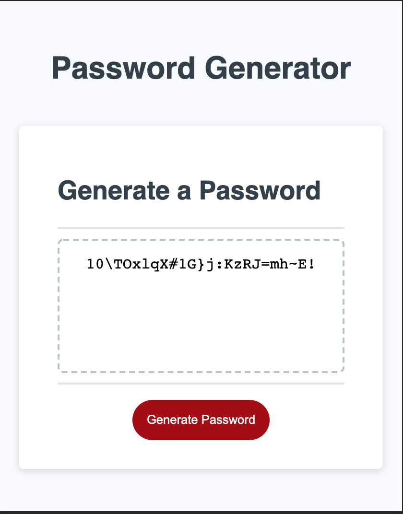

# Password Generator

This page utilizes Javascript to randomly generate a password. The user is first prompted to select a password length of at least 8 characters and no more than 128 characters. The user then confirms if they want to include lowercase, uppercase, numbers or special characters. At least one type of character must be selected. A password is then generated using the user's specifications and displayed on screen.

[Try it yourself!](http://jochsf.github.io/password-generator/)